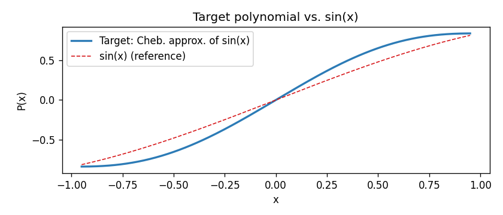

# Learning QSP Phase Angles via Gradient Descent

A PennyLane QML Community Demo that demonstrates how Quantum Signal Processing (QSP) phase angles can be trained from random initialization using JAX automatic differentiation and Optax's Adam optimizer — no analytic angle solver required.

<div align="center">

[](LICENSE)


[](https://nbviewer.org/github/rosspeili/qsp-pennylane-demo/blob/main/demo.ipynb)
[](https://colab.research.google.com/drive/1AQ3ZNxwo4ed0DtVDlsz_jLeMAgf_UJgQ?usp=sharing)
[](https://pennylane.ai/qml/demos_community)

</div>

---

## What This Is

Quantum Signal Processing encodes polynomial transformations of a signal into a quantum circuit
via a sequence of phase-shifted oracle calls. The standard approach computes the required phase
angles analytically given a target polynomial. This demo takes the opposite route: it starts
from random phase angles and trains them using gradient-based optimization (JAX + Optax) to
recover a target polynomial transformation.

The result is a working recipe for practitioners who need to optimize QSP angles for novel
polynomials where no analytic solver exists or where the polynomial is implicitly defined by
a loss function.

## Setup

```bash
git clone https://github.com/rosspeili/qsp-pennylane-demo
cd qsp-pennylane-demo
pip install -r requirements.txt
```

## Running the Demo

```bash
jupyter notebook demo.ipynb
```

Or run the tests:

```bash
pytest tests/ -v
```

## Structure

```
qsp-pennylane-demo/
├── demo.ipynb          # Main community demo notebook
├── qsp_jax/
│   ├── __init__.py
│   └── circuit.py      # Circuit construction and loss function
├── tests/
│   └── test_circuit.py # Unit tests
├── requirements.txt
├── LICENSE             # Apache 2.0
└── README.md
```

## Key Concepts

- **Signal oracle**: `W(x) = H @ RZ(-2*arccos(x)) @ H`, encoding signal `x ∈ (-1, 1)` in the top-left matrix element
- **QSP sequence**: Flat alternating circuit — one phase rotation `RZ(-2*phi_k)` per signal query `W(x)`
- **Polynomial encoding**: The expectation value `<X>` encodes a degree-d polynomial in `x` determined by the phase angles
- **Training**: Adam optimizer (Optax) minimizes MSE between circuit output and target polynomial via `jax.grad`
- **Note**: The circuit is implemented as inline `qp.RZ` + `qp.Hadamard` gates, not `qp.QSVT`, to preserve JAX traceability

## Target Polynomial

The default target is a **degree-5 Chebyshev approximation of `sin(x)`** on `[-1, 1]` — an odd polynomial bounded in `[-1, 1]`, consistent with QSP conventions for odd-degree transformations. It has a maximum deviation of ~0.174 from the true `sin(x)`.



## Results

After **500 Adam steps** (lr=0.05, 64-point signal grid), the trained phase angles reproduce the target polynomial with:

- **Final MSE: 4.82×10⁻⁴**
- **Max pointwise error: 9.83×10⁻²**

Loss drops from ~1.44 (random initialization) to ~6.4×10⁻⁴, converging quickly within the first 100 steps.


## References

- Martyn et al., [A Grand Unification of Quantum Algorithms](https://arxiv.org/abs/2105.02859), PRX Quantum 2021
- Gilyen et al., [Quantum singular value transformation](https://arxiv.org/abs/1806.01838), STOC 2019

## License

Apache 2.0. See [LICENSE](LICENSE).

---

## Press Release

[📄 View the Press Release](https://docs.google.com/document/d/1pamiIksg56KKkIIrCPj18YvCLocLVchkUFW3TM5Xs_o/edit?usp=sharing)
